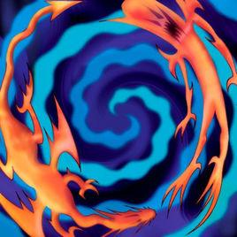

# 缝合怪像素字体 / Fusion Pixel Font

12 像素中文字体。

使用多个像素字体字形合并而成，因此命名为「缝合怪」。Logo 来源于 [《游戏王集换纸牌游戏》](https://zh.wikipedia.org/wiki/%E9%81%8A%E6%88%B2%E7%8E%8B%E9%9B%86%E6%8F%9B%E7%B4%99%E7%89%8C%E9%81%8A%E6%88%B2) 中的 [「融合」](https://baike.baidu.com/item/%E8%9E%8D%E5%90%88/2290464) 魔法卡卡图。

该项目为 [方舟像素字体](https://github.com/TakWolf/ark-pixel-font) 可用版本完成前的一种临时的字体解决方案。

## 字源

字源的要求：

- 像素字体，字形尺寸为 11 × 11
- 具有免费许可证，并且允许修改和衍生

目前使用的字体列表，按照字形优先级排列：

- [方舟像素字体-传统印刷版本](https://github.com/TakWolf/ark-pixel-font)
- [Galmuri9](https://github.com/quiple/galmuri)
- [俐方體11號](https://github.com/ACh-K/Cubic-11)

## 预览

[点击这里查看在线示例文本](https://fusion-pixel-font.takwolf.com)

## 下载

[下载地址](https://github.com/TakWolf/fusion-pixel-font/releases)

## 授权信息

### 字体

使用 [SIL 开放字体许可证 第1.1版（SIL Open Font License 1.1）](LICENSE-OFL) 授权，保留字体名称「缝合怪像素 / Fusion Pixel」。

使用的所有字源，均兼容该许可证。

### 构建程序

使用 [MIT 许可证](LICENSE) 授权。
