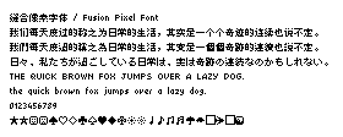
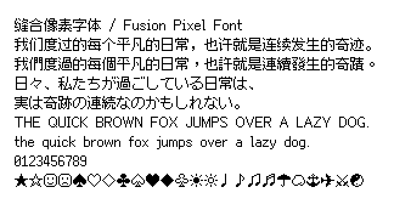

# 缝合像素字体 / Fusion Pixel Font

开源的泛中日韩像素字体，黑体无衬线风格，支持 8、10 和 12 像素。

该项目为 [「方舟像素字体」](https://github.com/TakWolf/ark-pixel-font) 的临时性过渡方案。使用多个像素字体合并而成，因此以「缝合」命名。

Logo 捏他自 [《游戏王》](https://zh.wikipedia.org/wiki/%E9%81%8A%E6%88%B2%E7%8E%8B) 中的 [「融合」](https://www.db.yugioh-card.com/yugiohdb/card_search.action?ope=2&cid=4837&request_locale=ja) 魔法卡卡图。

这个项目提供了从提取字模，合并字形到构建字体所需要的完整程序。

## 预览

可以通过 [Playground](https://fusion-pixel-font.takwolf.com/playground.html) 实时预览字体效果。

### 8 像素

[示例文本](https://fusion-pixel-font.takwolf.com/demo-8px.html) · [等宽模式-字母表](https://fusion-pixel-font.takwolf.com/alphabet-8px-monospaced.html) · [比例模式-字母表](https://fusion-pixel-font.takwolf.com/alphabet-8px-proportional.html)

### 10 像素

[示例文本](https://fusion-pixel-font.takwolf.com/demo-10px.html) · [等宽模式-字母表](https://fusion-pixel-font.takwolf.com/alphabet-10px-monospaced.html) · [比例模式-字母表](https://fusion-pixel-font.takwolf.com/alphabet-10px-proportional.html)

### 12 像素

[示例文本](https://fusion-pixel-font.takwolf.com/demo-12px.html) · [等宽模式-字母表](https://fusion-pixel-font.takwolf.com/alphabet-12px-monospaced.html) · [比例模式-字母表](https://fusion-pixel-font.takwolf.com/alphabet-12px-proportional.html)

## 字符统计

可以通过下面的链接来查看字体各尺寸目前支持的字符情况。

| 尺寸 | 等宽模式 | 比例模式 |
|---|---|---|
| 8px | [font-info-8px-monospaced](docs/font-info-8px-monospaced.md) | [font-info-8px-proportional](docs/font-info-8px-proportional.md) |
| 10px | [font-info-10px-monospaced](docs/font-info-10px-monospaced.md) | [font-info-10px-proportional](docs/font-info-10px-proportional.md) |
| 12px | [font-info-12px-monospaced](docs/font-info-12px-monospaced.md) | [font-info-12px-proportional](docs/font-info-12px-proportional.md) |

## 语言特定字形

目前支持以下语言特定字形版本：

| 版本 | 含义 |
|---|---|
| latin | 拉丁语 |
| zh_hans | 中文-简体 |
| zh_hant | 中文-繁體 |
| ja | 日语 |
| ko | 朝鲜语 |

尽管如此，这个项目仍然是一个基于补丁的字体解决方案。你不应该对语言特定字形抱有特别的期待。

## 下载

可通过以下渠道下载最新的版本：

- [GitHub Releases](https://github.com/TakWolf/fusion-pixel-font/releases)
- [123云盘](https://www.123pan.com/s/qKSojv-QUVSh.html)

目前提供 `.otf`、`.ttf`、`.woff2`、`.bdf`、`.pcf` 五种单字体格式，以及 `.otc`、`.ttc` 两种集合字体格式。

## 授权许可

分为「字体」和「构建程序」两个部分。

### 字体

使用 [「SIL 开放字体许可证第 1.1 版」](LICENSE-OFL) 授权，保留字体名称「缝合像素 / Fusion Pixel」。

第三方字源许可证如下：

| 字体 | 许可证 | 备注 |
|---|---|---|
| [方舟像素字体 / Ark Pixel Font](https://github.com/TakWolf/ark-pixel-font) | [OFL-1.1](https://github.com/TakWolf/ark-pixel-font/blob/develop/LICENSE-OFL) | 提供 10、12 像素基础字形和参数 |
| [美咲フォント / Misaki](https://littlelimit.net/misaki.htm) | [无类型许可证](assets/fonts/misaki/LICENSE.txt)，兼容 OFL-1.1 | 提供 8 像素日语汉字字形 |
| [寒蝉点阵体 / Chill-Bitmap](https://github.com/Warren2060/Chill-Bitmap) | [无类型许可证](https://github.com/Warren2060/Chill-Bitmap/blob/main/LICENSE.md)，兼容 OFL-1.1 | 提供 8 像素简体中文汉字字形 |
| [精品點陣體7×7 / BoutiqueBitmap7x7](https://github.com/scott0107000/BoutiqueBitmap7x7) | [OFL-1.1](https://github.com/scott0107000/BoutiqueBitmap7x7/blob/main/OFL.txt) | 提供 8 像素繁体中文汉字字形 |
| [精品點陣體9×9 / BoutiqueBitmap9x9](https://github.com/scott0107000/BoutiqueBitmap9x9) | [OFL-1.1](https://github.com/scott0107000/BoutiqueBitmap9x9/blob/main/OFL.txt) | 提供 10 像素繁体中文汉字补充 |
| [俐方體11號／Cubic 11](https://github.com/ACh-K/Cubic-11) | [OFL-1.1](https://github.com/ACh-K/Cubic-11/blob/main/OFL.txt) | 提供 12 像素繁体中文汉字补充 |
| [Galmuri](https://github.com/quiple/galmuri) | [OFL-1.1](https://github.com/quiple/galmuri/blob/main/ofl.md) | 提供 8、10、12 像素朝鲜语相关字形 |

### 构建程序

使用 [「MIT 许可证」](LICENSE-MIT) 授权。

## 官方社区

- [「像素字体工房」Discord 服务器](https://discord.gg/3GKtPKtjdU)
- [「像素字体工房」QQ 群 (302383204)](https://jq.qq.com/?_wv=1027&k=EXtKGHar)

## 程序依赖

- [Pixel Font Builder](https://github.com/TakWolf/pixel-font-builder)
- [FontTools](https://github.com/fonttools/fonttools)
- [Unidata Blocks](https://github.com/TakWolf/unidata-blocks)
- [Character Encoding Utils](https://github.com/TakWolf/character-encoding-utils)
- [PyYAML](https://github.com/yaml/pyyaml)
- [PyPNG](https://gitlab.com/drj11/pypng)
- [Pillow](https://github.com/python-pillow/Pillow)
- [Beautiful Soup](https://www.crummy.com/software/BeautifulSoup/)
- [Jinja](https://github.com/pallets/jinja)
- [GitPython](https://github.com/gitpython-developers/GitPython)
- [Requests](https://github.com/psf/requests)

## 赞助

如果这个项目对您有帮助，请考虑赞助来支持开发工作。

请通过下面的链接来查看收到的赞助的具体情况：

[赞助详情](https://github.com/TakWolf/TakWolf/blob/master/sponsors.md)
