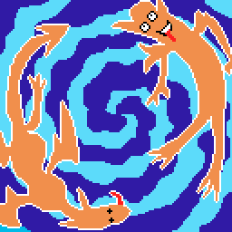
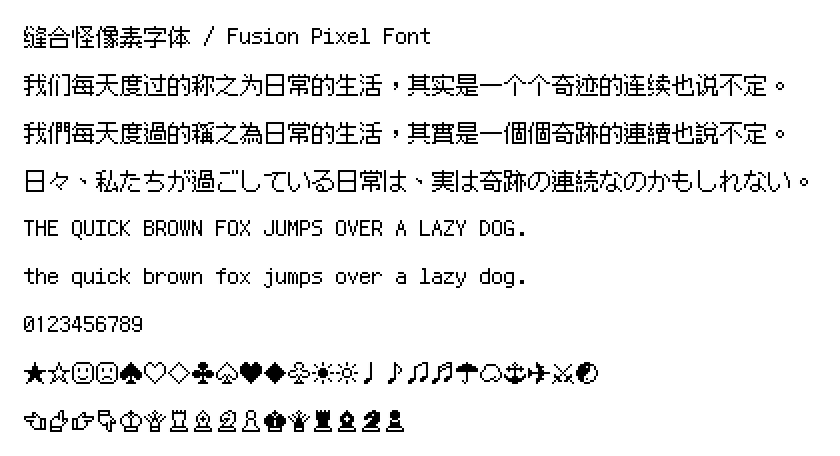

# 缝合怪像素字体 / Fusion Pixel Font

开源的泛中日韩像素字体，尺寸为 12px。

该项目为 [「方舟像素字体」](https://github.com/TakWolf/ark-pixel-font) 可用前的过渡方案。本质上是用 [「方舟像素字体」](https://github.com/TakWolf/ark-pixel-font) 作为基础，使用其他开源像素字体对缺失的字符进行补充。

由于使用多个像素字体合并而成，因此命名为「缝合怪」。Logo 捏他自 [《游戏王》](https://zh.wikipedia.org/wiki/%E9%81%8A%E6%88%B2%E7%8E%8B) 中的 [「融合」](https://zh.moegirl.org.cn/%E8%9E%8D%E5%90%88) 魔法卡卡图。

这个项目提供了从字模提取，到合并编译成字体所需要的完整程序。

## 预览

[示例文本](https://fusion-pixel-font.takwolf.com)

等宽模式：[字符统计](docs/font-info-monospaced.md) · [字母表](https://fusion-pixel-font.takwolf.com/alphabet-monospaced.html)

比例模式：[字符统计](docs/font-info-proportional.md) · [字母表](https://fusion-pixel-font.takwolf.com/alphabet-proportional.html)

## 案例

请 [在此](docs/cases.md) 查看使用案例。

## 字源

字源的要求：

- 字形具有像素外观，汉字部分字形尺寸为 11 × 11
- 使用 [OFL 1.1](https://scripts.sil.org/OFL) 或与之兼容的许可证授权
- 在 [GitHub](https://github.com) 上托管和分发字体

以下为使用的全部字源列表，按照字形使用优先级排列：

| 字体 | 版本 | 文件 |
|---|---|---|
| [方舟像素字体](https://github.com/TakWolf/ark-pixel-font) | [2022.12.20](https://github.com/TakWolf/ark-pixel-font/releases/tag/2022.12.20) | 12px-zh_cn.otf |
| [方舟像素字体-旧版](https://github.com/TakWolf/ark-pixel-font) | [2022.07.05](https://github.com/TakWolf/ark-pixel-font/releases/tag/2022.07.05) | ark-pixel-12px-zh_cn.otf |
| [俐方體11號](https://github.com/ACh-K/Cubic-11) | [1.013](https://github.com/ACh-K/Cubic-11/releases/tag/v1.013) | Cubic_11_1.013_R.ttf |
| [Galmuri](https://github.com/quiple/galmuri) | [2.35.6](https://github.com/quiple/galmuri/releases/tag/v2.35.6) | Galmuri11.ttf |

## 缺字

目前仍然缺少一部分 GB2312 和 Big5 编码的二级汉字。

该问题会随着 [「方舟像素字体」](https://github.com/TakWolf/ark-pixel-font) 的更新迭代而逐渐解决。

如果你在使用过程中仍然遇到缺字的情况，请在 [Issues](https://github.com/TakWolf/fusion-pixel-font/issues) 提交缺字列表，开发者会优先补充。

## 下载

可在 [Releases](https://github.com/TakWolf/fusion-pixel-font/releases) 下载最新的版本。

## 授权信息

分为「字体」和「构建程序」两个部分。

### 字体

使用 [SIL 开放字体许可证第 1.1 版](LICENSE-OFL) 授权，保留字体名称「缝合怪像素 / Fusion Pixel」。

使用的所有第三方字体，均兼容该许可证。

### 构建程序

使用 [MIT 许可证](LICENSE-MIT) 授权。